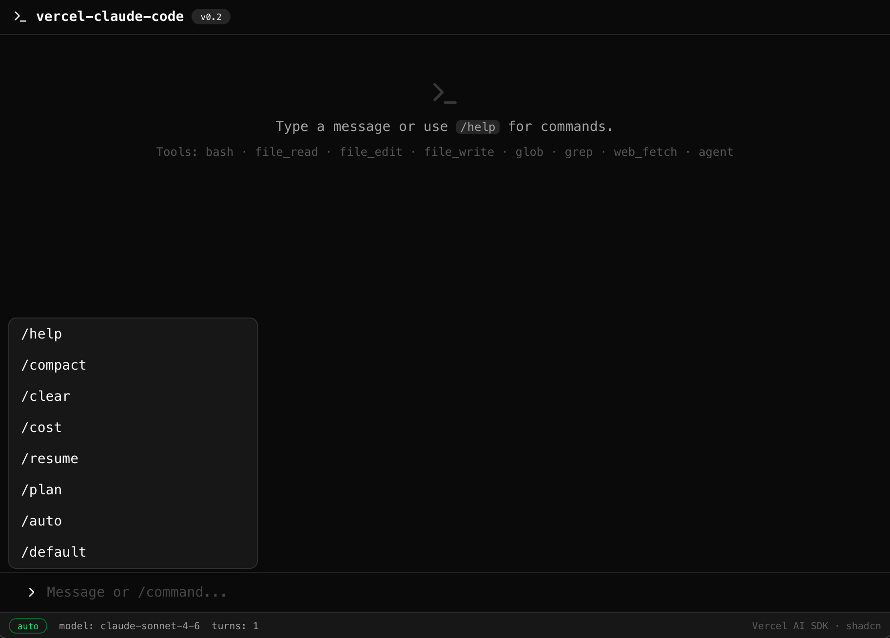
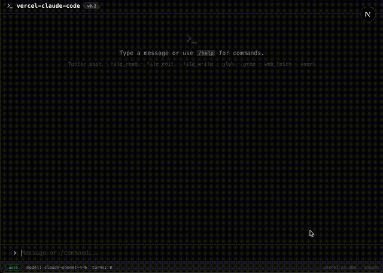

# vercel-claude-code

**Rebuild Claude Code's core agent architecture in ~5,000 lines using Vercel AI SDK.**

<p align="center">
  
</p>

<p align="center">
  
</p>

This project reverse-engineers [Claude Code](https://claude.ai/claude-code) (Anthropic's 512K-line CLI agent) and reconstructs its 22 core capabilities on top of [Vercel AI SDK](https://ai-sdk.dev) — proving that the SDK's primitives (`streamText`, `tool`, `useChat`) can replace tens of thousands of lines of hand-rolled agent infrastructure.

```
Claude Code:  512,664 lines / 1,902 files
This replica:   5,300 lines /    49 files
Compression:       96x
```

---

## Why This Exists

Claude Code's leaked source (March 2026) revealed a mature, production-grade agent architecture. Studying it raises a question: **how much of that complexity is essential, and how much does Vercel AI SDK already handle?**

The answer: AI SDK's `streamText({ tools, stopWhen })` collapses Claude Code's 46,000-line `QueryEngine` + `queryLoop` into a single function call. The SDK handles streaming, tool-call parsing, execution, result packaging, and multi-step looping internally. What remains for us is the **orchestration layer** — context assembly, memory, permissions, budgeting — which is where the real product logic lives.

---

## Architecture Mapping

### The Core Loop

Claude Code's heart is a `while(true)` loop that calls the LLM, extracts tool-use blocks, executes tools, packages results, and continues until `stop_reason === 'end_turn'`. Vercel AI SDK does all of this in one call:

```typescript
// Claude Code: ~2,000 lines across QueryEngine.ts + query.ts
// Vercel AI SDK: 8 lines
const result = streamText({
  model: getModelInstance("anthropic/claude-sonnet-4-6"),
  system: systemMessages,
  messages: modelMessages,
  tools: assembledTools,
  stopWhen: stepCountIs(25),
});

return result.toUIMessageStreamResponse();
```

### Full Capability Mapping

| # | Claude Code Capability | Lines | Vercel AI SDK Equivalent | Our Implementation |
|---|------------------------|-------|--------------------------|-------------------|
| **1** | **Query Loop** — `while(true) { callModel → runTools → continue }` | 46K | `streamText({ tools, stopWhen })` — built-in multi-step tool-call loop | `engine/agent.ts` (170 lines) |
| **2** | **Streaming Tool Execution** — execute tools while LLM is still streaming | embedded | Built into `streamText` — tools execute as soon as their input is complete | Free (SDK handles it) |
| **3** | **Error Recovery** — reactive compact on prompt-too-long, fallback model | ~500 | No built-in equivalent | `api/chat/route.ts` — catch → compact → retry |
| **4** | **Tool Interface** — `buildTool({ name, schema, call, checkPermissions })` | 29K | `tool({ description, inputSchema, execute })` — Zod schemas, async execute | `tools/*.ts` (8 files) |
| **5** | **Core Tools** — Bash, FileRead/Edit/Write, Glob, Grep | ~3K | `tool()` helper + Node.js APIs | 6 tool files, ~500 lines total |
| **6** | **Sub-Agent Spawning** — `AgentTool` with sync/async/worktree modes | 950 | `generateText({ tools, stopWhen })` — same engine, blocking call | `tools/agent-tool.ts` (80 lines) |
| **7** | **System Prompt Assembly** — 5-part construction (instructions + env + CLAUDE.md + memory + skills) | ~800 | `system` parameter accepts `SystemModelMessage[]` with Anthropic prompt caching | `engine/context.ts` (100 lines) |
| **8** | **Auto Compact** — compress old messages when approaching context limit | ~600 | No built-in equivalent | `engine/compact.ts` — estimate tokens → `generateText` summary → replace old messages |
| **9** | **Token Budget** — track usage, auto-continue or stop at 90% threshold | ~200 | `onFinish({ usage })` provides actual token counts | `engine/token-budget.ts` — tracker + decision logic |
| **10** | **Persistent Memory** — `~/.claude/projects/*/memory/` with YAML frontmatter | ~400 | No built-in equivalent | `engine/memory.ts` — file-based with scan, read, write, index |
| **11** | **Auto Memory Extraction** — fork agent analyzes conversation for memories | ~300 | `generateText` in `onFinish` callback | `engine/memory-extract.ts` — Haiku extracts → writes to disk |
| **12** | **Memory Recall** — Sonnet selects ≤5 relevant memories per turn | ~200 | `generateText` side-query before main call | `engine/memory-recall.ts` — Haiku selects from manifest |
| **13** | **Permission System** — 3-layer handler chain (hooks → classifier → user dialog) | ~1K | No built-in equivalent | `engine/permissions.ts` — mode-based (auto/plan/default) + danger patterns |
| **+** | **Skill System** — Markdown frontmatter prompts loaded from disk | ~300 | No built-in equivalent | `engine/skills.ts` — load from `.agent/skills/` |
| **+** | **Slash Commands** — `/compact`, `/help`, `/cost`, `/plan` | ~25K | No built-in equivalent | `engine/commands.ts` — 7 commands |
| **+** | **Session Persistence** — save/resume conversations | ~400 | No built-in equivalent | `engine/session.ts` + `/api/sessions` |
| **+** | **AskUserQuestion** — interactive option cards | ~300 | `tool()` with structured output | `tools/ask-user-tool.ts` |
| **+** | **WebFetch** — URL → Markdown conversion | ~400 | `tool()` + fetch API | `tools/web-tool.ts` |

### What AI SDK Gives You for Free

These Claude Code subsystems are **entirely replaced** by AI SDK primitives:

| Claude Code Subsystem | Lines Eliminated | AI SDK Primitive |
|----------------------|-----------------|-----------------|
| `queryLoop()` while-loop | ~2,000 | `streamText` multi-step loop |
| `StreamingToolExecutor` | ~500 | Built into `streamText` |
| `callModel()` + API streaming | ~1,500 | `streamText` handles Anthropic API |
| Tool-use block parsing | ~300 | Built into `streamText` |
| Tool result message packaging | ~200 | Built into `streamText` |
| `processUserInput()` message conversion | ~400 | `convertToModelMessages()` |
| Client-side message state management | ~2,000 | `useChat()` hook |
| Chat transport / HTTP streaming | ~500 | `DefaultChatTransport` + `toUIMessageStreamResponse()` |
| **Total** | **~7,400** | **~10 lines of config** |

### What You Still Need to Build

The SDK handles the **transport layer** (LLM calls, streaming, tool execution). The **product layer** — which defines your agent's personality — must be built:

```
┌─────────────────────────────────────────────┐
│            Product Layer (you build)         │
│                                             │
│  Context Assembly    Memory System          │
│  Permission Checks   Token Budgeting        │
│  Skill Loading       Session Management     │
│  Error Recovery      Slash Commands         │
│  Tool Definitions    UI Components          │
│                                             │
├─────────────────────────────────────────────┤
│          Vercel AI SDK (free)               │
│                                             │
│  streamText    tool()    useChat            │
│  generateText  Output    stepCountIs        │
│  DefaultChatTransport    onFinish           │
│  convertToModelMessages  isToolUIPart       │
│                                             │
├─────────────────────────────────────────────┤
│          LLM Provider (Anthropic)           │
│                                             │
│  Claude Sonnet 4.6   Claude Haiku 4.5      │
│  Prompt Caching      Tool Calling           │
│                                             │
└─────────────────────────────────────────────┘
```

---

## Project Structure

```
src/
├── lib/
│   ├── llm.ts                     # Dual provider factory (Anthropic + OpenRouter)
│   ├── engine/                    # ← This is your "QueryEngine"
│   │   ├── agent.ts               #   Core agent loop (streamText wrapper)
│   │   ├── context.ts             #   5-part system prompt assembly
│   │   ├── compact.ts             #   Auto + reactive context compression
│   │   ├── token-budget.ts        #   Token/USD budget tracking
│   │   ├── memory.ts              #   Persistent memory (read/write/scan)
│   │   ├── memory-extract.ts      #   Auto memory extraction (post-query)
│   │   ├── memory-recall.ts       #   Relevant memory retrieval (per-turn)
│   │   ├── permissions.ts         #   Tool permission checking
│   │   ├── skills.ts              #   Skill loading from .agent/skills/
│   │   ├── commands.ts            #   Slash command system
│   │   └── session.ts             #   Session save/resume
│   └── tools/                     # ← These are your "Tools"
│       ├── index.ts               #   Tool registry + permission filtering
│       ├── bash-tool.ts           #   Shell execution
│       ├── file-tools.ts          #   File read/edit/write
│       ├── search-tools.ts        #   Glob + Grep (ripgrep)
│       ├── agent-tool.ts          #   Sub-agent spawning
│       ├── web-tool.ts            #   URL fetching
│       └── ask-user-tool.ts       #   Interactive user questions
├── components/                    # ← Terminal-style Web UI
│   ├── ui/                        #   shadcn design system (13 components)
│   ├── chat-panel.tsx             #   Main panel (command autocomplete + status bar)
│   ├── tool-renderers.tsx         #   9 tool-specific renderers
│   ├── code-block.tsx             #   Shiki syntax highlighting
│   ├── diff-view.tsx              #   Structured line-level diff
│   ├── permission-dialog.tsx      #   Approve/Deny/Always Allow
│   └── use-ai-chat.ts            #   useChat hook with commands + auto-save
└── app/
    ├── api/chat/route.ts          #   Streaming endpoint (compact + budget)
    ├── api/sessions/route.ts      #   Session CRUD
    └── page.tsx                   #   Full-screen terminal UI
```

---

## Key Design Patterns

### 1. Provider Routing

Route models to the correct provider based on naming convention:

```typescript
// "claude-xxx" (no slash) → Anthropic (for structured output)
// "anthropic/xxx" → OpenRouter (for tool calling)
export function getModelInstance(model: string) {
  if (model.startsWith("claude-") && !model.includes("/")) {
    return getAnthropic()(model);
  }
  return getOpenRouter()(model);
}
```

### 2. Anti-Recursion in Sub-Agents

Sub-agents receive `baseTools` (without the `agent` tool itself), naturally preventing infinite nesting:

```typescript
const baseTools = { bash, file_read, file_edit, file_write, glob, grep, web_fetch };
return {
  ...baseTools,
  agent: createAgentTool(cwd, baseTools), // sub-agent can't spawn sub-sub-agents
};
```

### 3. Prompt Caching

Static prompt sections use Anthropic's ephemeral cache — subsequent turns skip re-processing:

```typescript
cachedSystemMessage(longInstructions, true);  // cache: true → anthropic ephemeral
cachedSystemMessage(recalledMemories, false);  // cache: false → changes per turn
```

### 4. Memory Lifecycle

```
User message → Memory Recall (Haiku selects ≤5 relevant)
                     ↓
              Inject into system prompt
                     ↓
              Agent processes + responds
                     ↓
              Memory Extraction (Haiku analyzes conversation)
                     ↓
              Write new memories to .agent/memory/
```

---

## Quick Start

[](https://vercel.com/new/clone?repository-url=https%3A%2F%2Fgithub.com%2FLa-fe%2Fvercel-claude-code&env=OPENROUTER_API_KEY&envDescription=OpenRouter%20API%20key%20for%20Claude%20access&project-name=vercel-claude-code)

### Local Development

```bash
git clone https://github.com/La-fe/vercel-claude-code.git
cd vercel-claude-code
pnpm install

# Configure
cp .env.example .env
# Edit .env → add OPENROUTER_API_KEY

# Run
pnpm dev
# Open http://localhost:3000
```

### Commands

| Command | Action |
|---------|--------|
| `/help` | List all commands |
| `/compact` | Compress conversation history |
| `/cost` | Show token usage and cost |
| `/plan` | Read-only mode (safe exploration) |
| `/auto` | Full mode (all tools enabled) |
| `/clear` | Clear conversation |
| `/resume` | Restore previous session |

---

## Tech Stack

| Layer | Technology |
|-------|-----------|
| AI SDK | [Vercel AI SDK](https://ai-sdk.dev) v6 (`streamText`, `tool`, `useChat`) |
| LLM | Claude Sonnet 4.6 (agent) + Claude Haiku 4.5 (fast tasks) via OpenRouter |
| Framework | Next.js 16 (App Router) |
| UI | [shadcn/ui](https://ui.shadcn.com) + Tailwind CSS 4 (dark terminal theme) |
| Syntax | [Shiki](https://shiki.style) (18 languages, github-dark) |
| Diff | [diff](https://github.com/kpdecker/jsdiff) (line-level structured diff) |
| Icons | [Lucide](https://lucide.dev) |

---

## What This Project Demonstrates

1. **Vercel AI SDK is sufficient** to build a Claude Code-class agent — the SDK handles the hardest parts (streaming, tool loops, message management)
2. **The real complexity is in orchestration** — context assembly, memory, permissions, and budgeting define the agent's behavior, not the LLM call loop
3. **107x compression is achievable** without losing core capabilities — by leveraging SDK primitives instead of reimplementing them
4. **Multi-model routing matters** — Haiku for fast classification/extraction, Sonnet for reasoning/tool-calling, with provider routing handled by a thin factory layer

---

## License

Educational project for studying AI agent architecture. Claude Code source is property of [Anthropic](https://www.anthropic.com).
